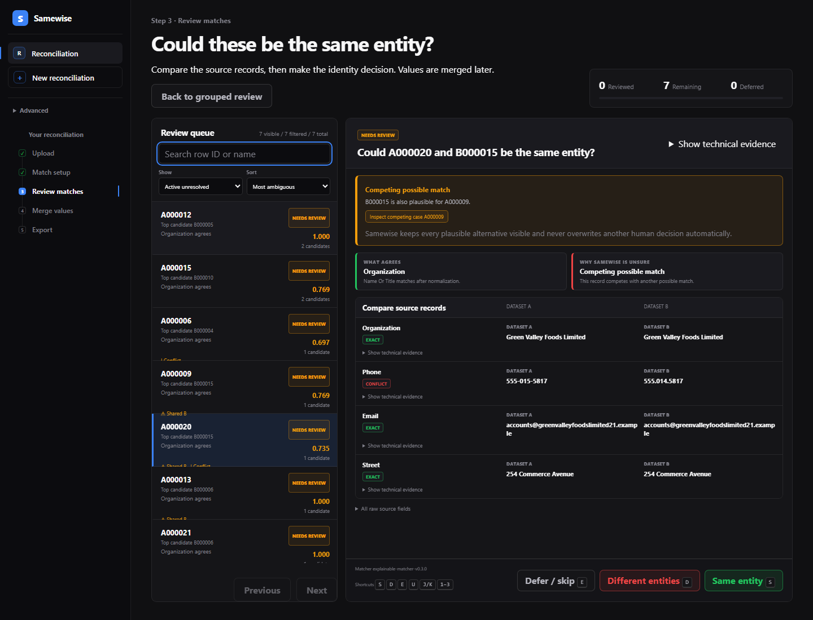
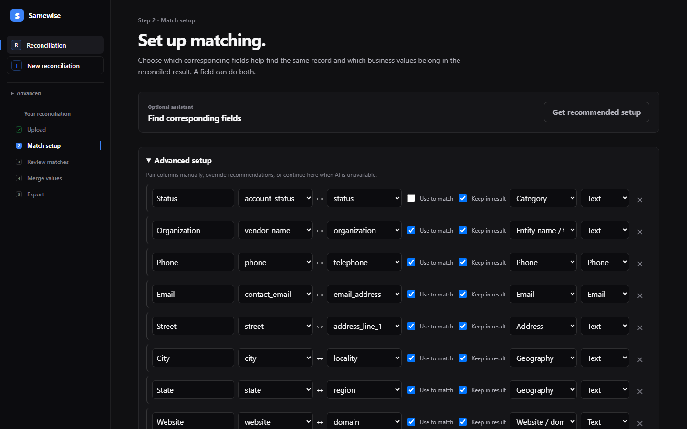
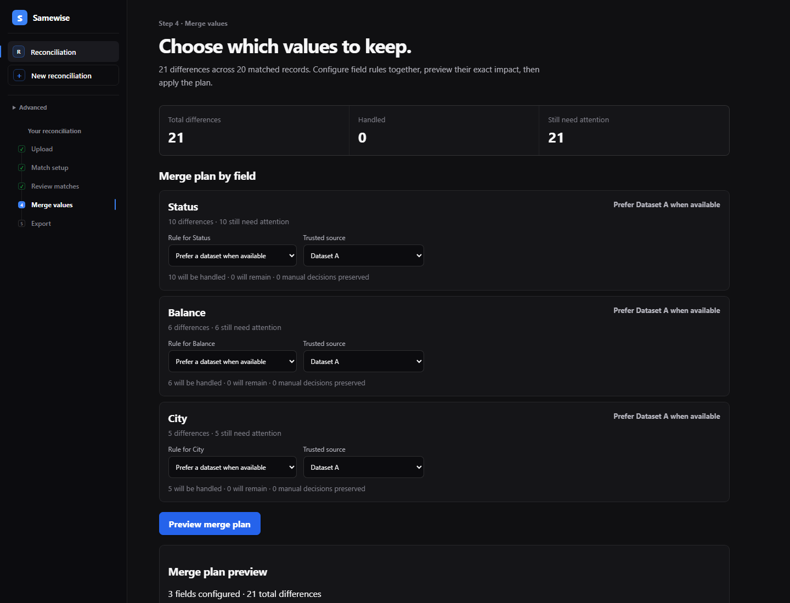
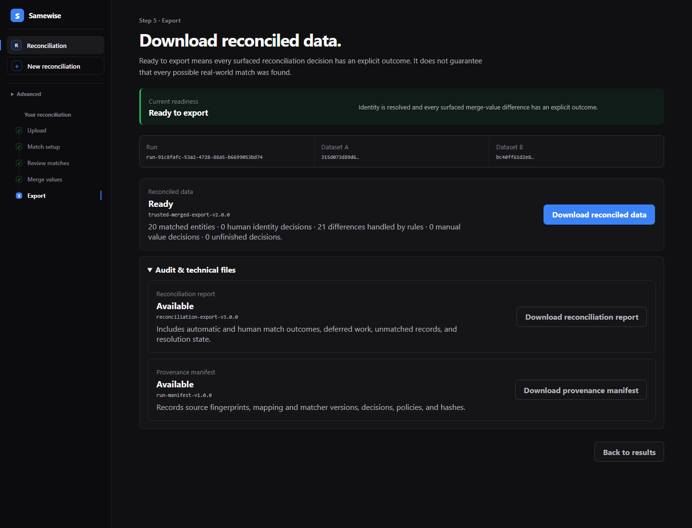
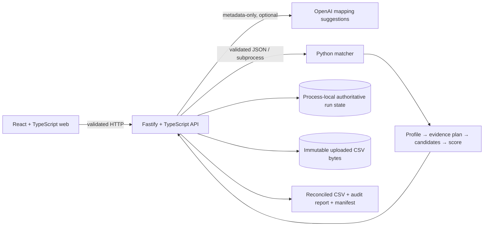

# Samewise

**Reconcile two overlapping datasets without blindly merging records.**

Samewise finds likely matches, asks people to resolve uncertainty, then separately helps them choose which values to keep. The result is a reconciled CSV with an audit report and a reproducible provenance manifest.

**[Live demo](https://trysamewise.vercel.app)** · **[Architecture](docs/architecture.md)** · **[Evaluation](docs/review-generalization-report.md)** · **[Run locally](#run-locally)**



*An uncertain match shows source records and real matcher evidence. Competing candidates remain visible; the reviewer decides identity before any value is merged.*

## What you do

| Step | In the product |
| --- | --- |
| **Upload** | Add two CSV files; Samewise profiles them and keeps the source bytes unchanged. |
| **Match setup** | Confirm corresponding fields, their semantic meaning, and independently choose **Use to match** and **Keep in result**. |
| **Review matches** | Inspect agreements, contradictions, alternatives, and collisions; decide uncertain identities individually or preview a safe group. |
| **Merge values** | Set field rules, preview their effect, explicitly apply them, then handle remaining exceptions. |
| **Export** | Download reconciled data when ready, plus an always-available reconciliation report and a provenance manifest. |


### A short product tour



*A field can help establish identity, appear in the final result, do both, or do neither. Semantic choices guide deterministic evidence planning.*



*Field rules are previewed before explicit application; manual resolutions remain authoritative until changed or cleared.*



*Trusted reconciled data is available only when readiness passes; the audit report and hashed manifest document the result.*

## Why this is harder than a join

Two rows can share a phone number yet describe different entities. One organization can appear under different names, and an identifier may be stable only inside its source. Samewise preserves these distinctions instead of treating every field as fuzzy text. The two questions stay separate:

> **Are these the same entity?** Then, **which value should be kept?**

An automatic link still does not choose a winning value. Weak evidence can lead to review or no match; a score is an inspectable evidence measure, not a calibrated probability.

## Engineering highlights

- **Dataset-adaptive evidence.** Confirmed mappings use bounded semantic families. Persistent IDs, source-local IDs, names, contacts, addresses, geography, dates, and unknown fields receive different, conservative treatment. A versioned evidence plan records the selected comparators and candidate configuration. See [ADR 0012](docs/decisions/0012-dataset-adaptive-semantic-evidence-and-review-groups.md).
- **Candidate generation before scoring.** Inverted indices and multiple semantic routes propose plausible pairs without comparing every A row with every B row. Candidate recall is measured separately because a missed true pair cannot be recovered by a better scorer.
- **Explainable decisions and abstention.** The versioned matcher records field agreements, contradictions, weights, blocker provenance, ranks, alternatives, and collision context. It reserves uncertain cases for a human and does not treat scores as probabilities.
- **Review at the right scale.** Bounded pages and on-demand details expose full authoritative evidence. Deterministic signatures group repeated patterns; batch Same/Different actions require a preview and record a decision for each eligible pair. Defer, restore, and guarded undo preserve review state.
- **Identity before values.** `useForMatching` and `includeInMerge` are independent. A closed set of merge rules supports preview and explicit apply, preserves manual exceptions, and can keep both source values without inventing a canonical truth.
- **Traceable outputs.** Immutable source fingerprints, confirmed mappings, matcher and evidence-plan versions, human decisions, merge policies, and exact CSV hashes are represented in the run manifest. Unresolved work remains visible in the reconciliation report; trusted output is gated.

**AI interprets schema metadata; algorithms match rows; people resolve uncertainty; evaluation tests the behavior.** OpenAI receives minimized column names and profile statistics through the API, never wholesale source rows or hidden evaluation truth. Its structured suggestions are validated and require confirmation. Manual mapping works without an API key.

## Architecture



The API owns review, merge, readiness, and exports. The Python process owns profiling, candidate generation, matching, and evaluation tooling. JSON Schema, Zod, and Pydantic validate the cross-language contracts. The browser receives bounded projections while complete evidence remains authoritative in API memory. [Read the architecture and lifecycle](docs/architecture.md).

## Evidence, with boundaries

The current [review-generalization closeout](docs/review-generalization-report.md) reports these **deterministic synthetic fixture** observations under the v0.3 matcher and v0.4 candidate engine:

| Fixture | Observed result | What it means |
| --- | --- | --- |
| Public-style 8K × 8K regression | 11,379 candidate pairs from 64,000,000 possible; 7,000 / 7,000 known overlapping pairs retained during candidate generation; review workload reduced from 1,312 cases to 822 | A controlled workflow regression, not customer accuracy or a public-service capacity claim. |
| Frozen 1,200-entity holdout | 866 / 879 known links retained as candidates; 169 / 169 automatic links correct | Exact holdout result for the current semantic configuration; the conservative change routes more cases to review. |
| Six small domain fixtures | Separate gates for organizations, people, products, facilities, sparse legacy, and low-information data | The low-information fixture makes zero automatic matches and abstains. These fixtures do not establish transfer to real uploads. |

The [SW-012 browser-delivery measurement](docs/sw-012-bounded-evidence.md) observed an 88,351-byte 50-case review page versus a 56,892,493-byte full matcher result on its documented 10K synthetic fixture. This measures transfer size, not retained server memory. The [SW-011 performance report](docs/sw-011-performance.md) covers a candidate-only 50K fixture; full 50K scoring was not measured. The public end-to-end walkthrough is **product-flow evidence**, not accuracy evidence. [Evaluation definitions and historical reports](docs/README.md#evaluation-and-historical-evidence) keep fixtures, versions, and denominators distinct.

## Tech stack

| Surface | Current implementation |
| --- | --- |
| Web | React 19, TypeScript, Vite; Vitest and Testing Library |
| API | Node.js 24, TypeScript, Fastify; Vitest |
| Matcher | Python 3.13, Pydantic; pytest and Ruff |
| Contracts | Versioned JSON Schema, Zod, and Pydantic boundary models |
| Optional AI | OpenAI structured semantic mapping through the server |
| Public demo | Vercel frontend, Railway API and Python matcher |

## Run locally

Use Node.js 24, pnpm 11, Python 3.13, and uv:

```text
pnpm install
uv sync --project services/matcher --locked
pnpm dev
```

Open `http://localhost:5173`; the API runs at `http://localhost:3000` and Vite proxies `/api`. Upload the visible synthetic files at `fixtures/corrupted/organizations/organizations-dev-v1/dataset_a.csv` and `dataset_b.csv`. Evaluation-only truth files must not enter product operation. `OPENAI_API_KEY` is optional and belongs only in the API server environment; never expose it through a `VITE_` variable. Set `SAMEWISE_PYTHON` if Python is not on `PATH`.

## Verification

```text
pnpm verify
pnpm --filter @samewise/web build
```

`verify` runs TypeScript lint, type checks, workspace tests, Python lint, and Python tests. Normal tests mock OpenAI and need no network or API key. The [API reference](docs/api.md) and [deployment notes](docs/deployment.md) cover operational details.

## Where Samewise fits

Use SQL or Power Query when clean keys or a straightforward deterministic or fuzzy join suffice. Samewise focuses on one-time, high-risk two-file reconciliation where alternatives, contradictions, human identity review, later value choices, and auditability matter. A mature MDM or commercial reconciliation platform is appropriate for durable entity stores, connectors, governance, and recurring enterprise operations. [SW-013 adversarial validation](evaluation/competitors/sw-013/summary.md) documents this boundary; it did not execute competing products.

## Current limits

Samewise is CSV-focused. Run state and full matcher evidence live in one API process; a restart loses active decisions, and uploaded files are local ephemeral artifacts. There is no authentication, durable database, global assignment, or enterprise deployment layer. Evidence scores are uncalibrated. Synthetic evaluation cannot establish real-data quality. Export artifacts are regenerated from current state rather than persisted or signed. These constraints also apply to the public demo.

## Repository and deeper documentation

`apps/web` is the guided UI; `apps/api` owns orchestration and export; `services/matcher` holds Python profiling, matching, and evaluation; `packages/contracts` defines the boundary; `fixtures` and `evaluation` keep visible inputs separate from hidden truth. Start with the [documentation index](docs/README.md), [product guide](docs/product.md), [architecture](docs/architecture.md), [API reference](docs/api.md), and [demo storyboard](docs/demo.md).
