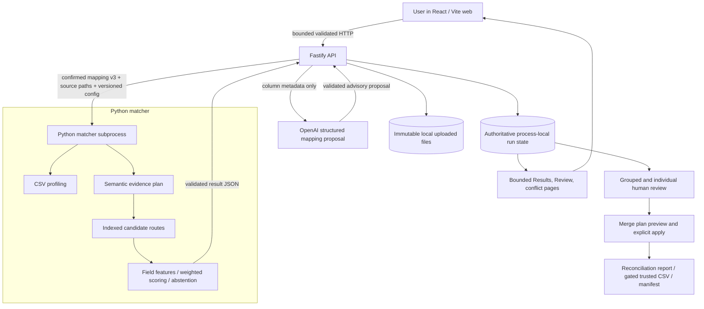

# Architecture

Samewise is a browser workflow over a process-local Fastify API and a short-lived Python matcher subprocess. The boundaries are deliberate: source bytes stay immutable, row matching remains deterministic and independently evaluable, and optional AI is limited to schema interpretation. [ADR 0012](decisions/0012-dataset-adaptive-semantic-evidence-and-review-groups.md) describes the current semantic and review-group design.

## Components and contracts

- **`apps/web`** presents Upload, Match setup, Review matches, Merge values, and Export. It consumes validated compact summaries and paged projections. It fetches complete candidate evidence on selection and keeps only a bounded detail cache.
- **`apps/api`** owns run state, immutable upload handling, mapping validation, review decisions, merge policies, readiness, and deterministic export generation. It retains the complete matcher result authoritatively in memory. List pages have a 50-item default and 100-item server maximum.
- **`services/matcher`** profiles CSVs, builds evidence plans and indexed candidate routes, computes versioned field evidence and bands, and contains evaluation tooling. It is invoked by Node through validated JSON on stdin/stdout; there is no Python HTTP server.
- **`packages/contracts`** holds the canonical JSON Schemas and Zod validation; Python has corresponding Pydantic models and shared compatibility tests. The internal workflow schema path is pre-release, not a public compatibility promise.
- **`fixtures` and `evaluation`** separate visible synthetic CSV inputs from hidden canonical truth, corruption provenance, and reports. Truth is loaded by evaluation after the matcher runs, never by product matching.

Current product constants live in `packages/contracts/src/workflow.ts`: `confirmed-mappings-v3`, `candidate-engine-v0.4.0`, `feature-pipeline-v0.2.0`, `explainable-matcher-v0.3.0`, `matcher-config-v0.3.0`, `evidence-plan-v1.0.0`, and `review-signature-v1.0.0`. Historical reports retain their measured versions.

## Run lifecycle

1. **Upload and profile.** Fastify writes each CSV once under a server-generated name in the ignored `.samewise-data/<run-id>/` directory, records a SHA-256 fingerprint, and invokes Python profiling. The source bytes are never rewritten by later actions.
2. **Confirm mappings.** A person connects A/B columns and independently sets `useForMatching` and `includeInMerge`. Optional OpenAI suggestions use column name, inferred type, null rate, and distinct rate only. The API validates structured output and referenced columns; the proposal has no authority until confirmed. Provider failure leaves manual setup available.
3. **Plan evidence and candidates.** The matcher uses confirmed semantic families: persistent identifiers, source-local identifiers, entity names, contact people, contact channels, addresses, geography, categorical/numeric/date/free text, and unknown. Explicit unknown fields stay conservative. Persistent IDs and domains use exact normalized comparison; source-local IDs are excluded from cross-source identity routes by default. The bounded evidence plan retains comparator and candidate configuration. Independent inverted-index routes union candidate pairs; oversized buckets are suppressed as whole units with provenance.
4. **Score and abstain.** Candidate pairs receive field-level normalized values, features, evidence classes, configured weights, positive and contradiction contributions, and deterministic explanation codes. Missing values do not shrink the denominator. Contradictions, narrow margins, alternatives, and collisions can prevent an automatic link. Scores are evidence, not calibrated probabilities. Matching never reads AI confidence, hidden fixture truth, or merge policy.
5. **Review identity.** The API derives bounded review pages and deterministic signatures from authoritative state. A signature combines sorted semantic/evidence/information classes with margin, alternatives, collision, and contradiction state. Group previews expose bounded representative cases and eligibility; a batch Same/Different action requires human confirmation and records a separate provenance-rich decision for every eligible pair. Other cases remain individual. Defer/restore and guarded undo operate on review state.
6. **Merge values.** Identity links can create field conflicts for mappings kept in the result, but cannot select a value. Closed deterministic field strategies, including Use A, Use B, Keep Both, non-null, trusted source, and explicitly mapped recency, are previewed before explicit application. The merge-plan preview token protects against applying a changed plan. Manual resolutions take precedence until explicitly changed or cleared.
7. **Export.** The reconciliation report remains available with unresolved state. Trusted merged CSV requires no pending/deferred identity and no required unresolved field conflicts. A manifest captures source fingerprints, mappings, candidate/matcher/evidence-plan provenance, decisions, merge policy, and hashes of exact CSV bytes. Ordinary runs retain the matcher-produced evidence plan, including candidate configuration; older runs without one report that absence. Unchanged authoritative state reproduces byte-identical exports. Artifacts are generated on request and are not persisted or signed.

## Delivery, failure, and retry boundaries

The browser receives a compact `RunSummary`, bounded Results/Review/conflict pages, and selected candidate detail. The full matcher result remains in API memory; [SW-012](sw-012-bounded-evidence.md) measures wire reduction, not retained-memory reduction. The API rejects malformed contracts and inaccessible candidate IDs. AI failures do not commit mappings. A failed matcher request does not imply a human decision or merge action. Export readiness is checked from current authoritative state for each request.

Runs, decisions, proposals, and complete evidence are process-local; upload files are local ephemeral artifacts. An API restart loses active run state. There is no durable database, authentication, queue, global assignment, or multi-record golden-entity store. The [deployment notes](deployment.md) describe the constrained Vercel/Railway public demo. [Evaluation](sw-009-evaluation.md) keeps synthetic ground truth and nonrepresentative human review labels distinct.
